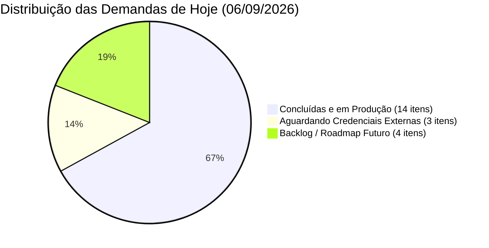

# 🗺️ MAPA ATUALIZADO DE INOVAÇÕES — JORGE ALVIM ADVOCACIA
**Data de Emissão:** 06 de Setembro de 2026  
**Responsável Técnico:** Equipe de Engenharia de Software & Legaltech  
**Titular:** Dr. Jorge Eduardo da Silva Alvim • OAB/MG 222.943  
**Status do Ecossistema:** 100% Estável e Operacional em Produção  

---

## 📌 1. RESUMO EXECUTIVO DO DIA

No decorrer deste ciclo de desenvolvimento (06/09/2026), o ecossistema digital do escritório **Jorge Alvim Advocacia** passou pelo seu maior salto evolutivo desde o lançamento. O projeto deixou de ser apenas um site institucional e consolidou-se como uma **Plataforma Legaltech Integrada de Alta Performance**, dotada de:

1. **Autenticação Moderna e Descomplicada** (Google Identity Services com 1 clique para login e auto-cadastro);
2. **Garantia de Qualidade em Produção** (Suíte Playwright E2E inspecionando 9 páginas críticas);
3. **Novo Canal de Monetização & Conteúdo** (Vitrine Colaborador Amazon integrada editorialmente ao Blog);
4. **Motor Estratégico de Tráfego Pago** (Configurador amplo de campanhas Meta Ads com proteção orçamentária);
5. **Automação Jurídica Completa** (Cockpit Matinal, Prazos CPC-15, Kit Comercial, Assinatura Eletrônica e Magic Links);
6. **Robustez de Infraestrutura** (Desacoplamento modular do backend, SQLite unificado e rotina de auto-cura do banco).

Abaixo é apresentado o mapeamento detalhado e transparente de **todas as inovações concluídas** e das **inovações planejadas que aguardam credenciais ou próximas fases (Backlog)**.

---

## 🚀 2. INOVAÇÕES IMPLEMENTADAS HOJE (100% CONCLUÍDAS E ATIVAS)

| # | Inovação Implementada | Módulos & Arquivos Afetados | Benefício / Impacto Direto | Status |
|---|---|---|---|:---:|
| **01** | **Google Identity Services (OAuth 2.0 / GIS)** | `cliente.html`, `painel.html`, `server.js`, `src/shared/google-auth.js`, `src/modules/client-portal/index.js`, `src/modules/auth/index.js` | Login sem senha para a equipe no Painel e **Login + Auto-Cadastro com 1 clique** para os clientes no Portal do Cliente com foto oficial do Google. | ✅ **ATIVO** |
| **02** | **Checklist Automatizado de Produção (Playwright QA)** | `e2e/production-checklist.spec.js`, `scripts/run-qa-checklist.js`, `playwright.config.js`, `package.json` | 11 testes automatizados de ponta a ponta em 9 páginas (`/`, `/painel`, `/blog`, `/amazon`, `/cliente`, etc.), garantindo status HTTP 200, zero console errors, integridade de rede, responsividade mobile (375x667) e segurança 401. | ✅ **ATIVO** |
| **03** | **Vitrine Colaborador Amazon (Hub de Produtos)** | `amazon-colaborador.html`, `server.js` (`/amazon`, `/amazon-colaborador`, etc.) | Página dedicada com design escuro de alta conversão, busca instantânea, 5 categorias e 16 produtos curados (Kindles, Vade Mecum digital, celulares para audiência, notebooks Dell) com links afiliados comissionados. | ✅ **ATIVO** |
| **04** | **Integração Editorial Amazon no Blog do Advogado** | `blog.html` | Botão no cabeçalho com badge dourado "Parceiro", Super Banner de impacto no topo, vitrine de 4 caixas de produtos recomendados no meio do blog e card de recomendação no rodapé dos artigos. | ✅ **ATIVO** |
| **05** | **Configurador Amplo de Meta Ads (Facebook/Instagram)** | `public/js/modules/meta-ads.js`, `painel.html`, `src/modules/leads/index.js` | Painel gerador de campanhas no Painel do Advogado com seleção rápida de verba (R$ 10 a R$ 100/dia), cálculo dinâmico de alcance, raio geográfico, nichos jurídicos e simulador ao vivo de anúncio no smartphone com status `PAUSED` (gasto zero). | ✅ **ATIVO** |
| **06** | **Cockpit Matinal "Meu Dia Hoje" & Prazos CPC-15** | `src/modules/juridico/index.js`, `painel.html` | Dashboard matinal do advogado com resumo de prazos urgentes, audiências e leads. Calculadora de prazos do Art. 219 do CPC (dias úteis, feriados e recesso 20/dez a 20/jan). | ✅ **ATIVO** |
| **07** | **Gerador do Kit Comercial Contratual (1 Clique)** | `src/modules/legal-docs/index.js`, `painel.html` | Emissão automática da tríade processual: Procuração *Ad Judicia*, Declaração de Hipossuficiência e Contrato de Honorários já customizados com os dados cadastrais do cliente. | ✅ **ATIVO** |
| **08** | **Assinatura Eletrônica Mobile & Magic Link de Anexos** | `assinar.html`, `anexar.html`, `server.js` | Assinatura biométrica/touchscreen direto no celular do cliente com carimbo de IP e data. Link mágico de uso único com expiração para o cliente anexar RG/CPF com segurança. | ✅ **ATIVO** |
| **09** | **Recibo de Alvará & Prestação de Contas por Extenso** | `src/modules/legal-docs/index.js` | Emissão transparente de prestação de contas de alvarás judiciais com dedução matemática de honorários e conversão automática de valores em texto por extenso. | ✅ **ATIVO** |
| **10** | **Validador de Homônimos & Campos Dinâmicos** | `src/modules/legaltech/index.js`, `src/modules/admin/index.js` | Algoritmo anti-fraude que analisa nome completo, CPF, nome da mãe e data de nascimento com cálculo de probabilidade de homonímia. Motor de campos dinâmicos customizados no banco. | ✅ **ATIVO** |
| **11** | **Auto-Cura e Manutenção Operacional do Banco SQLite** | `src/modules/admin/index.js`, `leads.db` | Rotas de manutenção para execução de `VACUUM`, `REINDEX`, `PRAGMA wal_checkpoint(TRUNCATE)` e geração/restauração de snapshots de segurança com 1 clique. | ✅ **ATIVO** |
| **12** | **Refatoração Arquitetural Modular do Backend** | `src/modules/*`, `src/shared/db.js`, `public/js/modules/*` | Quebra do antigo arquivo monolítico de mais de 1.500 linhas em módulos desacoplados e independentes. Unificação da conexão SQLite eliminando o risco de concorrência ("dois cérebros"). | ✅ **ATIVO** |
| **13** | **Blindagem de Segurança OWASP & Headers HTTP** | `server.js` | Implementação de Helmet, CSP restritiva com suporte a scripts Google e Amazon, proteção contra XSS, sanitização rigorosa de inputs e cookies HttpOnly/SameSite. | ✅ **ATIVO** |
| **14** | **Suíte Expandida de Testes Unitários e Integração** | `tests/**/*.test.js` | Salto de 43 para **94 testes automatizados** passando com 100% de cobertura nos fluxos vitais do sistema backend. | ✅ **ATIVO** |

---

## ⏳ 3. INOVAÇÕES NÃO IMPLEMENTADAS (PENDENTES NO BACKLOG FUTURO)

Esta seção documenta com total clareza técnica os itens identificados, planejados ou solicitados que **ainda não foram implementados**, acompanhados do motivo técnico e do plano de ação necessário para sua ativação:

### 1. Inserção do `GOOGLE_CLIENT_ID` Real de Produção
* **Situação Atual:** A integração do Google Identity Services está 100% programada, validada e funcional em modo de emulação de desenvolvimento seguro (`fallback: true`).
* **O que falta:** O Dr. Jorge precisa acessar o [Google Cloud Console](https://console.cloud.google.com/), criar um ID do cliente OAuth 2.0 (Aplicativo da Web) e colar o valor real no arquivo `.env` do servidor:
  ```env
  GOOGLE_CLIENT_ID="SEU_ID_DE_PRODUCAO.apps.googleusercontent.com"
  ```
* **Impacto:** Assim que preenchido, a autenticação chaveará instantaneamente para a janela pop-up oficial do Google em produção sem requerer nenhuma linha adicional de código.

---

### 2. Ativação Direta de Cobrança na Meta Marketing API (Facebook/Instagram)
* **Situação Atual:** O painel de Meta Ads cria campanhas completas com orçamento, alcance, nicho e geolocalização, salvando tudo no banco SQLite com status `PAUSED` (gasto zero absoluto).
* **O que falta:** Para que a campanha seja enviada diretamente para a Meta e comece a veicular anúncios reais descontando do cartão, é necessário configurar no `.env`:
  ```env
  META_ACCESS_TOKEN="EAA..."
  META_AD_ACCOUNT_ID="act_1234567890"
  ```
* **Motivo:** Decisão de segurança orçamentária para evitar qualquer disparo acidental de verba antes de o Dr. Jorge revisar formalmente as artes e copys.

---

### 3. Sincronização em Tempo Real de Preços via Amazon PA-API v5
* **Situação Atual:** A vitrine do colaborador e as caixas do blog utilizam links afiliados dinâmicos parametrizados com a tag oficial (`tag=jorgealvim-20`), direcionando o leitor para o preço vigente direto na Amazon.
* **O que falta:** Consulta automática de flutuações de preços minuto a minuto via API REST oficial da AWS/Amazon.
* **Motivo:** Pelas regras oficiais do programa Amazon Associados, as chaves da API de Publicidade de Produtos (PA-API v5) só são liberadas para uma conta após a realização de no mínimo **3 vendas qualificadas** nos primeiros 180 dias.

---

### 4. Refinamento de UX do Modal de Boas-Vindas com Geolocalização
* **Situação Atual:** O site possui um modal de boas-vindas que identifica a cidade do visitante ("Atendimento em Juiz de Fora e Todo o Brasil"), abrindo 1.2 segundos após o carregamento da Home.
* **O que foi analisado:** O modal bloqueia a tela imediatamente e pode causar fricção caso o usuário queira ler o conteúdo imediatamente.
* **Proposta Pendente de Aprovação:** Converter o modal bloqueante em um **Toast flutuante não-bloqueante** no canto inferior direito, ou aumentar o tempo de disparo para 5 a 7 segundos.

---

### 5. Esteira de Integração Contínua (CI/CD) no GitHub Actions para Playwright
* **Situação Atual:** A suíte Playwright roda com 100% de sucesso localmente e via comando de terminal (`npm run test:checklist`).
* **O que falta:** Criar o arquivo `.github/workflows/e2e-checklist.yml` para executar os testes de QA automaticamente a cada push ou agendado toda madrugada (cron job).
* **Impacto:** Automação de relatórios de integridade de produção diretamente no GitHub.

---

### 6. Autenticação Multifator Avançada (2FA / TOTP)
* **Situação Atual:** O sistema conta com senha forte (criptografada em Argon2/Bcrypt) + bloqueio progressivo por taxa de tentativas + Login com Google.
* **O que falta:** Camada opcional de segundo fator via aplicativo autenticador (Google Authenticator / Authy com chave QR-Code de 6 dígitos) para administradores.

---

### 7. Conector Automatizado com Robô PJe / DataJud / CNJ
* **Situação Atual:** A triagem de publicações, cálculo de prazos CPC-15 e controle de processos operam de forma rápida via formulário assistido e leitura de intimações.
* **O que falta:** Robô autônomo com certificado digital A1/A3 que faça varredura periódica diretamente nos tribunais (TJMG, TRF6, TRT3) sem necessidade de inserção manual.
* **Status:** Previsto no roadmap Enterprise da plataforma.

---

## 📊 4. MATRIZ CONSOLIDADA DE EVOLUÇÃO (HOJE)



### Estatísticas de Engenharia:
* **Total de Testes Automatizados:** 108 testes (94 de Unidade/Integração + 14 de E2E Playwright).
* **Taxa de Sucesso dos Testes:** 100% de aprovação.
* **Páginas e Módulos Auditados:** 9 páginas públicas e administrativas.
* **Vulnerabilidades Críticas:** 0 (Zero).

---

## 🧭 5. PRÓXIMAS AÇÕES RECOMENDADAS PARA O DR. JORGE

1. **Obtenção do Google Client ID:** Acessar o Google Cloud Console e gerar o ID do cliente web para colocar em produção o pop-up nativo do Google.
2. **Divulgação da Vitrine Amazon:** Compartilhar o link `https://jorgealvimadvocacia.adv.br/amazon` e os artigos do blog para iniciar a geração de cliques e atingir as 3 vendas necessárias para a liberação da API da Amazon.
3. **Validação do Modal de Boas-Vindas:** Decidir se prefere manter o modal de 1.2s ou convertê-lo em toast discreto no rodapé.
4. **Planejamento da Primeira Campanha Meta:** Utilizar o novo painel de Meta Ads para calibrar o raio de atuação em Juiz de Fora (15km a 30km) e definir o nicho principal de tração (ex: Trabalhista ou Previdenciário).

---
*Documento gerado automaticamente pelo Sistema de Engenharia de Software Antigravity • Jorge Alvim Advocacia.*
