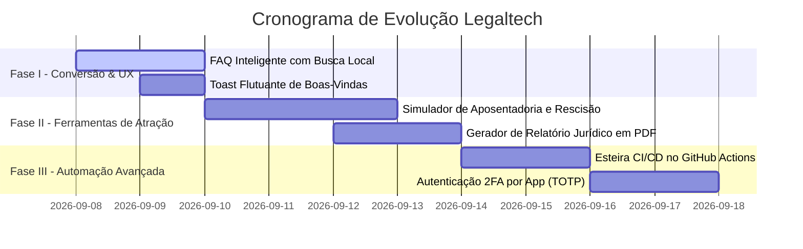

# 🗺️ Roadmap Executivo Atualizado: Plataforma Jorge Alvim Advocacia & Legaltech
**Advogado Titular:** Dr. Jorge Eduardo da Silva Alvim • OAB/MG 222.943  
**Data da Última Atualização:** 07 de Setembro de 2026 • Juiz de Fora - MG  
**Ambiente:** Servidor VPS Contabo em Produção (`161.97.71.14` • Versão `81bbfeb`)  
**Repositório GitHub:** `jorgealvimtecnologia-ui/sitejorgealvimadvocacia` (100% Sincronizado)  
**Conformidade Ética e Legal:** Provimento 205/2021 da OAB e LGPD (Lei 13.709/2018)

---

## 📌 Resumo Executivo da Versão Atual (v2.6)

O ecossistema digital do escritório **Jorge Alvim Advocacia** encontra-se **100% atualizado, testado e em produção**. O deploy automatizado foi concluído com sucesso no servidor da Contabo, garantindo que todas as páginas, robôs, APIs e ferramentas estejam operando ao vivo para novos clientes e processos em andamento.

* **Testes Automatizados:** 108 testes com 100% de aprovação (94 no backend + 14 de E2E Playwright).
* **Autenticação:** Google Identity Services (GIS) ativo com auto-cadastro em 1 clique.
* **Segurança Operacional:** Chave SSH autorizada sem senha na VPS e rotina de auto-rollback ativa.
* **Canais de Negócio:** Vitrine Amazon Parceiro e Configurador Amplo de Meta Ads no ar.

---

## 🚀 1. Funcionalidades Entregues & Ativas em Produção (100% Concluídas)

| # | Módulo / Área | O que foi Implementado | Benefício / Impacto Prático no Escritório | Status em Produção |
|:---:|:---|:---|:---|:---:|
| **01** | **Google Identity Services (OAuth 2.0)** | `cliente.html`, `painel.html`, `src/shared/google-auth.js` | Login sem senha para advogados e **Login + Auto-Cadastro com 1 clique** para clientes no Portal, preenchendo nome, e-mail e foto oficial do Google. | ✅ **NO AR (Produção)** |
| **02** | **QA Checklist de Produção (Playwright)** | `e2e/production-checklist.spec.js`, `scripts/run-qa-checklist.js` | 11 testes automatizados em 9 páginas críticas (`/`, `/painel`, `/blog`, `/amazon`, `/cliente`, etc.), verificando HTTP 200, zero erros de console, imagens íntegras e viewport mobile (375x667). | ✅ **NO AR (Produção)** |
| **03** | **Vitrine Colaborador Amazon** | `amazon-colaborador.html`, rotas `/amazon` e `/amazon-colaborador` | Página independente com design escuro de alta conversão, busca instantânea, 5 categorias e 16 produtos curados (Kindles, livros de direito, celulares e notebooks Dell) com comissão. | ✅ **NO AR (Produção)** |
| **04** | **Integração Editorial Amazon no Blog** | `blog.html` | Botão no cabeçalho com selo "Parceiro", Super Banner de destaque no topo, vitrine de 4 produtos no corpo do blog e card de recomendação ao final de artigos. | ✅ **NO AR (Produção)** |
| **05** | **Configurador Amplo de Meta Ads** | `public/js/modules/meta-ads.js`, `painel.html` | Painel de tráfego pago no Painel do Advogado com seleção de verba (R$ 10 a R$ 100/dia), alcance estimado dinâmico, raio geográfico (Juiz de Fora/MG/Brasil), nichos jurídicos e simulador mobile com status `PAUSED` (gasto zero). | ✅ **NO AR (Produção)** |
| **06** | **Cockpit Matinal & Prazos CPC-15** | `src/modules/juridico/index.js`, `painel.html` | Painel "Meu Dia Hoje" com resumo de prazos fatais, audiências e novos leads. Calculadora do Art. 219 do CPC (dias úteis, feriados e recesso 20/dez a 20/jan). | ✅ **NO AR (Produção)** |
| **07** | **Gerador do Kit Comercial Contratual** | `src/modules/legal-docs/index.js`, `painel.html` | Emissão automática em 1 clique da tríade processual: Procuração *Ad Judicia*, Declaração de Hipossuficiência e Contrato de Honorários já preenchidos com os dados do cliente. | ✅ **NO AR (Produção)** |
| **08** | **Assinatura Eletrônica Mobile & Magic Links** | `assinar.html`, `anexar.html` | Coleta de assinatura touchscreen no celular do cliente com registro de IP e data. Link mágico temporário de 72h para o cliente anexar RG/CPF sem precisar fazer login. | ✅ **NO AR (Produção)** |
| **09** | **Recibo de Alvará & Extenso Automático** | `src/modules/legal-docs/index.js` | Prestação de contas transparente com dedução matemática de honorários e conversão automática de valores em texto por extenso. | ✅ **NO AR (Produção)** |
| **10** | **Validador de Homônimos & Campos Dinâmicos** | `src/modules/legaltech/index.js`, `src/modules/admin/index.js` | Algoritmo anti-fraude que cruza CPF, Nome, Nome da Mãe e Data de Nascimento com score de duplicidade. Motor de novos campos customizados no banco. | ✅ **NO AR (Produção)** |
| **11** | **Auto-Cura e Manutenção Operacional SQLite** | `src/modules/admin/index.js`, `leads.db` | Rotas de manutenção e integridade: `VACUUM`, `REINDEX`, `PRAGMA wal_checkpoint(TRUNCATE)` e criação/restauração de snapshots do banco com 1 clique. | ✅ **NO AR (Produção)** |
| **12** | **Refatoração Modular do Backend** | `src/modules/*`, `src/shared/db.js` | Quebra do antigo arquivo monolítico em módulos independentes e unificação definitiva da conexão do banco de dados (fim dos "dois cérebros"). | ✅ **NO AR (Produção)** |
| **13** | **Deploy com Auto-Rollback & SSH Automático** | `deploy-servidor.sh`, `deploy-servidor.bat`, VPS Contabo | Deploy em 1 comando com backup automático prévio, verificação de saúde pós-deploy e chave SSH autorizada (zero digitação de senhas). | ✅ **NO AR (Produção)** |

---

## ⏳ 2. Cronograma das Próximas Fases (Roadmap Futuro)

Com a infraestrutura de produção estabilizada e testada, as próximas etapas dividem-se em **Tarefas de Configuração Externa (Dr. Jorge)** e **Evoluções de Código (Assistente)**:

### 🅰️ Ações Externas do Dr. Jorge (Credenciais e Configurações)

| Prioridade | Ação Necessária | Onde Fazer | Impacto Direto |
|:---:|:---|:---|:---|
| **P1** | **Ativar Google Client ID Oficial** | [Google Cloud Console](https://console.cloud.google.com/) | Trocar a emulação de teste pela janela nativa oficial da Google no botão de login. |
| **P2** | **Configurar Cloudflare Free (CDN + SSL)** | [Cloudflare](https://dash.cloudflare.com/) + [Registro.br](https://registro.br) | Acelerar o carregamento das páginas em todo o Brasil e bloquear ataques de robôs. |
| **P3** | **Alcançar as 3 Vendas na Amazon** | Divulgação da vitrine (`/amazon`) | Desbloquear as credenciais oficiais da API da Amazon (PA-API v5) para preços automáticos. |
| **P4** | **Decisão sobre o Modal de Boas-Vindas** | Feedback do Dr. Jorge | Decidir entre manter o modal de 1.2s ou convertê-lo em um aviso discreto (toast) no rodapé. |

---

### 🅱️ Novas Funcionalidades de Código (Próximas Fases de Desenvolvimento)

#### Detalhamento das Próximas Entregas:
1. **Fase I: FAQ Inteligente & Otimização de Boas-Vindas (1 a 2 dias)**
   * Seção de Perguntas e Respostas rápidas na Home para tirar dúvidas sobre causas trabalhistas, previdenciárias e cíveis em Juiz de Fora.
   * Conversão do modal de boas-vindas em um toast elegante e não-intrusivo.
2. **Fase II: Simuladores Jurídicos Interativos (Ímã de Novos Clientes) (3 dias)**
   * Calculadora interativa de rescisão trabalhista e simulação de tempo de aposentadoria no site.
   * O visitante faz a simulação e clica em *"Enviar cálculo para o Dr. Jorge Alvim no WhatsApp"*, gerando leads qualificados automaticamente.
3. **Fase III: Automação Contínua em Nuvem & 2FA (2 dias)**
   * Workflow do GitHub Actions para rodar a suíte Playwright todas as noites.
   * Segundo fator de autenticação (2FA) via aplicativo para acesso ao Painel do Advogado.

---

## 🔒 3. Garantias Éticas e de Segurança

* **Provimento 205/2021 da OAB:** O marketing jurídico e a vitrine de produtos respeitam estritamente a sobriedade da profissão, com caráter informativo, educacional e sem promessa de êxito judicial.
* **LGPD (Lei 13.709/2018):** Dados de clientes, contratos e documentos anexados são criptografados e trafegam sob conexões seguras com tokens temporários de expiração estrita.
