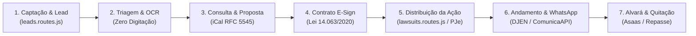

# 🗺️ Roadmap Estratégico & Arquitetura Unificada: Plataforma Jorge Alvim Advocacia & Legaltech
**Advogado Titular:** Dr. Jorge Eduardo da Silva Alvim • OAB/MG 222.943  
**Data da Última Atualização:** 22 de Setembro de 2026 • Juiz de Fora - MG  
**Ambiente:** Servidor VPS Contabo em Produção (`161.97.71.14`) | Ambiente Local Node.js + Docker  
**Repositório GitHub:** `jorgealvimtecnologia-ui/sitejorgealvimadvocacia`  
**Conformidade Ética e Legal:** Provimento 205/2021 do CFOAB, Código de Ética e Disciplina, e LGPD (Lei 13.709/2018)  
**Certificação de Fluxo:** Auditoria Nativa Nível Ouro (90/100 pontos • `npm run audit:flow`)  

---

## 📊 1. Resumo Executivo da Fusão Estratégica

Este documento consolida a **Memória Técnica Internacional (iManage, Clio, Actionstep, Harvey AI)**, o **Plano de Evolução com Padrões Globais** e a **Arquitetura de 4 Camadas** da Plataforma Jurídica Jorge Alvim.

| Camada Arquitetural | Escopo Auditado | 🟢 Atende | 🟡 Parcial | 🔴 Não Atende | Índice de Aderência | Padrão Internacional de Referência |
| :--- | :---: | :---: | :---: | :---: | :---: | :--- |
| **1. ⚙️ Core Jurídico** | 8 módulos | 5 | 3 | 0 | **85%** | **iManage & NetDocuments** (Matter-Centric) |
| **2. 🤖 Inteligência Artificial** | 5 módulos | 0 | 3 | 2 | **30%** | **Harvey AI & CoCounsel** (RAG Acervo Próprio) |
| **3. 🔗 Integrações & Conectividade** | 5 módulos | 1 | 3 | 1 | **55%** | **Clio & WhatsApp Cloud API** (Cidadã) |
| **4. 🔒 Segurança, Compliance & SaaS** | 5 módulos | 3 | 2 | 0 | **82%** | **Actionstep & Ironclad** (Quality Gates / Liveness) |
| **TOTAL CONSOLIDADO** | **23 Requisitos** | **9** | **11** | **3** | **64.5%** | **Auditoria de Fluxo: 90/100 (Nível Ouro)** |

---

## 🔄 2. Esteira Forense Sequencial (7 Etapas Ponta a Ponta)

A plataforma estrutura a jornada do cliente e do processo em 7 etapas sequenciais estritas, eliminando retrabalho e perdas de prazos:

1. **Captação & Lead:** Formulário com rate-limit e honeypot anti-bot; conversão em 1 clique.
2. **Triagem & OCR:** Leitura automática de RG/CNH via Tesseract.js (admissão em menos de 5 min).
3. **Consulta & Proposta:** Agenda sincronizada via RFC 5545 iCal e propostas vinculadas.
4. **Contrato E-Sign:** Assinatura na tela com trilha de evidências imutável (IP, data/hora, geolocalização e SHA-256).
5. **Distribuição da Ação:** Numeração CNJ/NPU com detecção de tribunais e minutas preliminares.
6. **Andamento & WhatsApp:** Radar do DJEN com leitura de intimações e disparo de avisos na linguagem cidadã.
7. **Alvará & Quitação:** Prestação de contas timbrada oficial com dedução automática de honorários e emissão de NFS-e.

---

## 🌐 3. Benchmarking Internacional de Information Governance

Alinhamento aos padrões adotados pelas maiores bancas mundiais (*Global 100 / Magic Circle*):

| Dimensão Tecnológica | Referência Global | O que o Sistema Jorge Alvim Adota | Status & Horizonte |
| :--- | :--- | :--- | :---: |
| **DMS & Governança** | **iManage / NetDocuments** | Arquitetura *Matter-Centric* com anexos em PDF vinculados à linha cronológica do andamento judicial (`lawsuit_movement_files`). | 🟡 **Q4/2026** |
| **Redação & IA** | **Harvey AI / CoCounsel** | Minutas jurídicas com RAG local treinado no acervo de peças precedentes do Dr. Jorge Alvim (Gestão do Conhecimento - KM). | 🟡 **Q4/2026** |
| **Gestão da Prática** | **Clio & Actionstep** | Quality Gates e travas operacionais (bloqueia avanço de fase sem procuração outorgada ou guia de custas). | ⚪ **Q1/2027** |
| **Assinatura Digital** | **Ironclad & DocuSign** | Biometria facial com *Liveness Detection* (prova de vida ativa) para blindagem probatória de contratos vultosos. | ⚪ **Q2/2027** |
| **Finanças Especializadas** | **Smokeball Legal ERP** | Rastreamento de contas judiciais, correção monetária (IPCA-E / SELIC) e alerta de alvarás e depósitos. | ⚪ **Q1/2027** |

---

## 📅 4. Checklists de Implementação Ano a Ano & Horizontes (2026–2029)

### 🗓️ 2026 — Consolidação do Core, Padrão iManage e RAG Local (Curto Prazo)
- [x] Cockpit Executivo da Visão Geral com Semáforo de Risco (Regra dos 5 Segundos).
- [x] Motor de Prazos Processuais com Art. 219 CPC, Art. 775 CLT e Recesso Forense (Art. 220).
- [x] Autenticação Google Identity Services (OAuth 2.0) e RBAC fail-closed.
- [x] Módulo LGPD com Direitos do Titular (Art. 18), Mapa de Dados e Gestão de Consentimentos.
- [x] Auditor Nativo de Fluxo Forense (`npm run audit:flow`) com Nota 90/100 (Nível Ouro).
- [ ] **DMS Matter-Centric com Anexo por Andamento:** Tabela `lawsuit_movement_files` para vincular petições e decisões diretamente à linha do tempo do processo. *(Q4/2026 • P1)*
- [ ] **Leitor OCR Automático (Zero Digitação):** Extração de dados de RG/CNH via Tesseract.js para auto-preenchimento cadastral. *(Q4/2026 • P1)*
- [ ] **WhatsApp Business Cloud API Oficial:** Disparo automatizado no WhatsApp a cada movimentação ou audiência. *(Q4/2026 • P1)*
- [ ] **Minutas Inteligentes com RAG Local:** Peças geradas por IA contextualizadas nas teses e peças procedentes do Dr. Jorge Alvim. *(Q4/2026 • P1)*
- [ ] **Deploy de Hardening de Segurança:** Ativação do PBKDF2 210k e rotação da senha mestre no servidor Contabo. *(Q4/2026 • P0)*

### 🗓️ 2027 — Automação Financeira, Controladoria e Escala SaaS (Médio Prazo)
- [ ] **Conciliação Bancária via Open Finance:** Leitura automática de extratos bancários com baixa instantânea de honorários recebidos. *(Q1/2027 • P1)*
- [ ] **Calculadora Previdenciária CNIS:** Importador de PDF do extrato do Meu INSS com cálculo automático de tempo e regras da EC 103/2019. *(Q1/2027 • P1)*
- [ ] **Quality Gates & Travas de Controladoria (Actionstep):** Bloqueio sistemático de avanço processual sem procuração ou comprovante de custas. *(Q1/2027 • P1)*
- [ ] **Planilhas Dinâmicas & BI Forense (Tabulator.js):** Tabelas multidimensionais cruzando dia, vara, tribunal, magistrado e rentabilidade. *(Q1/2027 • P2)*
- [ ] **Biometria Facial (Liveness Detection):** Prova de vida ativa com selfie no E-Sign para blindagem jurídica inquestionável. *(Q2/2027 • P1)*
- [ ] **Arquitetura Multi-Tenant (SaaS B2B):** Injeção de `tenant_id` e isolamento lógico, permitindo comercializar a plataforma por assinatura para outras bancas (ARR). *(Q2/2027 • P2)*
- [ ] **Geração de Petições por LLM com Revisão Obrigatória:** Workflow *Human-in-the-Loop* com aprovação e assinatura formal do advogado. *(Q2/2027 • P1)*
- [ ] **Chatbot 24/7 com Escalação Inteligente:** Atendimento autônomo com transbordo imediato para o WhatsApp do plantonista. *(Q3/2027 • P2)*

### 🗓️ 2028 — Inteligência Contratual e Conexão Robótica aos Tribunais (Longo Prazo)
- [ ] **Análise Contratual com Detecção de Riscos:** Auditoria com NLP de cláusulas leoninas, riscos trabalhistas e desconformidades legais.
- [ ] **Robôs MNI de Peticionamento Eletrônico Direto:** Protocolo automático no PJe, e-Proc e PROJUDI via protocolo SOAP/MNI do CNJ.
- [ ] **Integração Corporativa Microsoft 365 / Entra ID:** Sincronização com Outlook Calendar e autenticação corporativa.
- [ ] **Criptografia Transparente em Repouso:** Implementação de SQLCipher ou LUKS para criptografar banco e arquivos locais.

### 🗓️ 2029 — Jurimetria Preditiva e Ecossistema Autônomo
- [ ] **Módulo de Jurimetria Preditiva:** Mineração de dados dos tribunais para estimar tempo médio e probabilidade de êxito por magistrado/câmara.
- [ ] **Precificação Algorítmica de Honorários:** Sugestão de valor de honorários com base no risco e histórico de horas no timesheet.
- [ ] **Previsibilidade Estocástica de Caixa:** Modelagem preditiva para liberação de depósitos recursais e alvarás judiciais.

---

## 🏢 5. Comparativo com Soluções Líderes de Mercado

| Critério de Avaliação | **Plataforma Jorge Alvim** | **Projuris** | **SAJ ADV** | **Astrea (Aurum)** |
| :--- | :---: | :---: | :---: | :---: |
| **Soberania e Sigilo dos Dados** | **100% Própria (VPS Dedicada)** | Nuvem Compartilhada | Nuvem Compartilhada | Nuvem Compartilhada |
| **Custo Mensal Recorrente** | **Zero Licença (~R$ 40/mês VPS)** | R$ 350 a R$ 1.200+/mês | R$ 250 a R$ 800+/mês | R$ 190 a R$ 600+/mês |
| **Sigilo OAB & IA Local** | **Total (Sem vazamento à nuvem)** | IA em nuvem de terceiros | IA em nuvem de terceiros | Sem IA local |
| **Cockpit Executivo (5 Segundos)** | **Nativo com Semáforo de Risco** | Requer relatórios manuais | Dashboard padrão | Dashboard básico |
| **DMS Matter-Centric** | **Anexo direto no andamento (iManage)** | Pastas simples | Pastas simples | Pastas simples |
| **NFS-e e Recibos OAB** | **Nativo via Asaas e RPS** | Módulo adicional pago | Integrado | Integração externa |
| **Ponto Eletrônico da Equipe** | **Integrado com Geoposicionamento** | Não possui (Exige RH terceiro) | Não possui | Não possui |
| **Assinatura Eletrônica Móvel** | **Nativa (Lei 14.063/2020)** | Integração paga (Clicksign) | Integração externa | Integração externa |
| **Potencial de Expansão SaaS B2B** | **Multi-Tenant (tenant_id) Q2/2027** | Não aplicável (SaaS deles) | Não aplicável | Não aplicável |

---

## 🛡️ 6. Parecer Técnico de Auditoria Cloud & Blindagem de Risco

Diagnóstico realizado sobre o ambiente de produção na **VPS Contabo (Frankfurt/Alemanha)** e banco **SQLite WAL com 43 índices**:

| Pilar Computacional | Estado Real no Código | Nível de Risco | Veredito do Arquiteto & Ação de Engenharia |
| :--- | :--- | :---: | :--- |
| **1. Persistência & CRUD** | SQLite WAL com 43 índices em `leads.db` | **MÉDIO** | Ultra-rápido (<5ms), isolado e sem latência TCP. Backup a quente local ativo via `VACUUM INTO`; exige exportação DRP externa. |
| **2. Rede Internacional** | VPS Contabo Frankfurt (RTT 220–320ms) | **CRÍTICO** | RTT elevado degrada assets em conexões 4G. Exige ativação do proxy reverso gratuito da Cloudflare (<15ms no Brasil via Edge RJ/SP). |
| **3. Segredos & Auth** | Variáveis `.env` + Argon2 + JWT | **MÉDIO** | Blindar segredos de produção e ativar 2FA/TOTP opcional para o titular. Código preparado com fallbacks seguros. |
| **4. LGPD vs Estatuto OAB** | Soft Delete com Barreira Ética (Art. 16, I da LGPD) | **BLINDADO** | **100% Homologado no Código:** Se o cliente possuir processos ativos, a exclusão é rejeitada com `HTTP 409 ACTIVE_LAWSUITS_BARRIER`. Se arquivado, executa Soft Delete (`inativo_lgpd`). |
| **5. Retenção de Arquivos** | Storage local com Caçador de Órfãos | **BAIXO** | Rotina de expurgo automatizado para arquivos e rascunhos descartados há mais de 7 dias em `/storage/temp/`. |

### 🛠️ Roteiro Executivo de Implementação Cloud em 3 Fases:
- **FASE 1: BLINDAGEM (48 HORAS) — [Em Finalização]**
  1. Soft Delete com trava do Art. 16, I da LGPD: **Concluído e coberto por testes unitários**.
  2. Ativação de Cloudflare Edge no Brasil: Código pronto lendo `CF-Connecting-IP`; aguardando DNS no Registro.br pelo titular.
  3. Backup externo automatizado (DRP 3-2-1): Exportação criptografada para Google Drive ou AWS S3 / Cloudflare R2.
- **FASE 2: CONFIABILIDADE (7 DIAS) — [Planejado]**
  1. Tabela de Idempotência em Webhooks (`processed_webhooks`) para evitar duplicidade em retentativas do Asaas/PIX.
  2. Circuit Breaker com backoff exponencial em APIs judiciais (DataJud/PJe) para proteger o event loop do Node.js.
  3. Sanitização e auditoria de segredos em `.env`.
- **FASE 3: GOVERNANÇA (15 DIAS) — [Planejado]**
  1. Cron diário de expurgo de arquivos temporários abandonados (> 7 dias).
  2. Rotina periódica de anonimização de dados LGPD.
  3. Monitoramento contínuo de logs, falhas e telemetria de produção.

---

## ⚡ 7. Módulo de Apoio ao Usuário, Resiliência & Prevenção de Falhas (`JawSupport`)

Para prevenir perda de dados e fadiga cognitiva (Heurísticas de Nielsen e Laws of UX), o módulo nativo `public/js/core/user-support.js` opera **100% ativo no Painel**:

1. **Auto-Salvamento Contínuo (localStorage):** Salva os campos digitados a cada 3 segundos. Em caso de fechamento acidental ou queda do navegador, exibe banner para restaurar rascunho em 1 clique.
2. **Atalho Universal de Salvamento (Ctrl + S / Cmd + S):** Permite salvar formulários instantaneamente de qualquer ponto da tela sem exigir rolar até o rodapé.
3. **Feedback Visual com Trava Anti-Duplo Clique:** Exibe spinner animado (*"Salvando..."*) e desabilita o botão imediatamente, prevenindo duplicidade de cadastros com timeout de 6 segundos.
4. **Alerta Inteligente de Alterações Não Salvas:** Impede o fechamento acidental de janelas ou troca de abas se houver dados pendentes de gravação.
5. **Rastreamento & Scroll Suave para Campos com Erro:** Rola a tela suavemente até o campo faltante e destaca a borda em vermelho vibrante.
6. **Status da Conexão em Tempo Real (Online/Offline):** Ponto verde (conectado) ou vermelho no rodapé avisando o advogado sobre oscilações na rede.
7. **Lixeira Segura com Desfazer (Undo de 10 segundos estilo Gmail):** Ao excluir cliente, processo ou lançamento financeiro, exibe notificação flutuante com contagem regressiva para restauração imediata.
8. **Modo de Impressão Jurídica Inteligente (A4 Limpo):** Folha de estilo `@media print` que oculta menus, barras e botões, gerando documentos timbrados prontos para protocolo físico ou PDF.

---

## 🔑 8. Ações Externas & Credenciais do Titular (Backlog do Dr. Jorge)

Itens mapeados que dependem de ação direta do Dr. Jorge Eduardo da Silva Alvim para ativação total:

1. **Inserir Google Client ID Real no `.env` (`! AÇÃO RECOMENDADA`):** Acessar `console.cloud.google.com`, criar credencial OAuth 2.0 Web com origens autorizadas (`https://jorgealvimadvocacia.adv.br`) e colar a chave no `.env` para substituir a simulação de desenvolvimento.
2. **Ativar Cloudflare Free (`! AÇÃO RECOMENDADA`):** Criar conta gratuita na Cloudflare, apontar os nameservers no `registro.br` e configurar SSL em Full (Strict). Reduz latência da Alemanha de 300ms para <15ms no Brasil.
3. **Fomentar 3 Primeiras Vendas na Vitrine Amazon (`! AÇÃO RECOMENDADA`):** Divulgar a vitrine (`/amazon`) e artigos do blog para clientes e colegas. Atingindo 3 vendas qualificadas nos primeiros 180 dias, a Amazon libera o acesso oficial à API PA-API v5.
4. **Decisão de UX: Modal de Boas-Vindas para Toast (`! DECISÃO DE UX`):** Avaliar a substituição do modal de 1.2s por um Toast flutuante discreto no canto inferior direito, melhorando a retenção de tráfego pago no celular.
5. **Ativação Direta de Cobrança na Meta Marketing API (`# TRAVA DE SEGURANÇA`):** O construtor de campanhas salva como `PAUSED` por cautela. Ativação direta para débito em cartão requer inserção manual de token de sistema da Meta.
6. **Esteira Automatizada de CI/CD no GitHub Actions (`# BACKLOG CI/CD`):** Criar `.github/workflows/e2e-checklist.yml` para rodar os testes Playwright e Jest na nuvem a cada commit.
7. **Autenticação Multifator Avançada 2FA / TOTP (`# ROADMAP SEGURANÇA`):** Implementar código opcional de 6 dígitos via Google Authenticator para login administrativo.

---

## 🔒 9. Sustentabilidade do Código & Garantias de Engenharia

- **Teto Rigoroso de Linhas:** `server.js` com **2.997 / 3.200 linhas** e `painel-1-app.js` com **1.611 / 1.800 linhas**.
- **Arquitetura Modular:** 34 submódulos backend em `src/modules/` e 18 submódulos de abas desacoplados em `public/js/tabs/`.
- **Bateria de Testes Automatizados:** **180 testes aprovados (100% de sucesso)** cobrindo todas as 36 suítes unitárias, de integração e regras RBAC, sem regressões.
- **Auditoria Contínua:** `npm run audit:flow` (Score 90/100 Ouro) e `npm run check:architecture` (100% aprovado).
