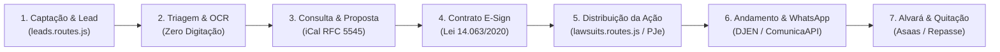

# 🗺️ Roadmap Estratégico & Arquitetura Unificada: Plataforma Jorge Alvim Advocacia & Legaltech
**Advogado Titular:** Dr. Jorge Eduardo da Silva Alvim • OAB/MG 222.943  
**Data da Última Atualização:** 3 de Outubro de 2026 • Juiz de Fora - MG  
**Ambiente:** Servidor VPS Contabo em Produção (`161.97.71.14`) | Ambiente Local Node.js + Docker  
**Repositório GitHub:** `jorgealvimtecnologia-ui/sitejorgealvimadvocacia`  
**Conformidade Ética e Legal:** Provimento 205/2021 do CFOAB, Código de Ética e Disciplina, e LGPD (Lei 13.709/2018)  
**Certificação de Fluxo:** Auditoria Nativa Nível Ouro (90/100 pontos • `npm run audit:flow`)  

---

## 📊 1. Resumo Executivo da Fusão Estratégica

Este documento consolida a **Memória Técnica Internacional (iManage, Clio, Actionstep, Harvey AI)**, o **Plano de Evolução com Padrões Globais** e a **Arquitetura de 4 Camadas** da Plataforma Jurídica Jorge Alvim.

| Camada Arquitetural | Escopo Auditado | 🟢 Atende | 🟡 Parcial | 🔴 Não Atende | Índice de Aderência | Padrão Internacional de Referência |
| :--- | :---: | :---: | :---: | :---: | :---: | :--- |
| **1. ⚙️ Core Jurídico** | 8 módulos | 5 | 3 | 0 | **85%** | **iManage & NetDocuments** (Matter-Centric) |
| **2. 🤖 Inteligência Artificial** | 5 módulos | 0 | 3 | 2 | **30%** | **Harvey AI & CoCounsel** (RAG Acervo Próprio) |
| **3. 🔗 Integrações & Conectividade** | 5 módulos | 1 | 3 | 1 | **55%** | **Clio & WhatsApp Cloud API** (Cidadã) |
| **4. 🔒 Segurança, Compliance & SaaS** | 5 módulos | 3 | 2 | 0 | **82%** | **Actionstep & Ironclad** (Quality Gates / Liveness) |
| **TOTAL CONSOLIDADO** | **23 Requisitos** | **9** | **11** | **3** | **64.5%** | **Auditoria de Fluxo: 90/100 (Nível Ouro)** |

---

## 🔄 2. Esteira Forense Sequencial (7 Etapas Ponta a Ponta)

A plataforma estrutura a jornada do cliente e do processo em 7 etapas sequenciais estritas, eliminando retrabalho e perdas de prazos:

```mermaid
flowchart LR
    E1["1. Captação & Lead<br/>(leads.routes.js)"] --> E2["2. Triagem & OCR<br/>(Zero Digitação)"]
    E2 --> E3["3. Consulta & Proposta<br/>(iCal RFC 5545)"]
    E3 --> E4["4. Contrato E-Sign<br/>(Lei 14.063/2020)"]
    E4 --> E5["5. Distribuição da Ação<br/>(lawsuits.routes.js / PJe)"]
    E5 --> E6["6. Andamento & WhatsApp<br/>(DJEN / ComunicaAPI)"]
    E6 --> E7["7. Alvará & Quitação<br/>(Asaas / Repasse)"]
```

1. **Captação & Lead:** Formulário com rate-limit e honeypot anti-bot; conversão em 1 clique.
2. **Triagem & OCR:** Leitura automática de RG/CNH via Tesseract.js (admissão em menos de 5 min).
3. **Consulta & Proposta:** Agenda sincronizada via RFC 5545 iCal e propostas vinculadas.
4. **Contrato E-Sign:** Assinatura na tela com trilha de evidências imutável (IP, data/hora, geolocalização e SHA-256).
5. **Distribuição da Ação:** Numeração CNJ/NPU com detecção de tribunais e minutas preliminares.
6. **Andamento & WhatsApp:** Radar do DJEN com leitura de intimações e disparo de avisos na linguagem cidadã.
7. **Alvará & Quitação:** Prestação de contas timbrada oficial com dedução automática de honorários e emissão de NFS-e.

---

## 🌐 3. Benchmarking Internacional de Information Governance

Alinhamento aos padrões adotados pelas maiores bancas mundiais (*Global 100 / Magic Circle*):

| Dimensão Tecnológica | Referência Global | O que o Sistema Jorge Alvim Adota | Status & Horizonte |
| :--- | :--- | :--- | :---: |
| **DMS & Governança** | **iManage / NetDocuments** | Arquitetura *Matter-Centric* com anexos em PDF vinculados à linha cronológica do andamento judicial (`lawsuit_movement_files`). | 🟡 **Q4/2026** |
| **Redação & IA** | **Harvey AI / CoCounsel** | Minutas jurídicas com RAG local treinado no acervo de peças precedentes do Dr. Jorge Alvim (Gestão do Conhecimento - KM). | 🟡 **Q4/2026** |
| **Gestão da Prática** | **Clio & Actionstep** | Quality Gates e travas operacionais (bloqueia avanço de fase sem procuração outorgada ou guia de custas). | ⚪ **Q1/2027** |
| **Assinatura Digital** | **Ironclad & DocuSign** | Biometria facial com *Liveness Detection* (prova de vida ativa) para blindagem probatória de contratos vultosos. | ⚪ **Q2/2027** |
| **Finanças Especializadas** | **Smokeball Legal ERP** | Rastreamento de contas judiciais, correção monetária (IPCA-E / SELIC) e alerta de alvarás e depósitos. | ⚪ **Q1/2027** |

---

## 📅 4. Checklists de Implementação Ano a Ano & Horizontes (2026–2029)

### 🗓️ 2026 — Consolidação do Core, Padrão iManage e RAG Local (Curto Prazo)
- [x] Cockpit Executivo da Visão Geral com Semáforo de Risco (Regra dos 5 Segundos).
- [x] Motor de Prazos Processuais com Art. 219 CPC, Art. 775 CLT e Recesso Forense (Art. 220).
- [x] Autenticação Google Identity Services (OAuth 2.0) e RBAC fail-closed.
- [x] Módulo LGPD com Direitos do Titular (Art. 18), Mapa de Dados e Gestão de Consentimentos.
- [x] Auditor Nativo de Fluxo Forense (`npm run audit:flow`) com Nota 90/100 (Nível Ouro).
- [ ] **DMS Matter-Centric com Anexo por Andamento:** Tabela `lawsuit_movement_files` para vincular petições e decisões diretamente à linha do tempo do processo. *(Q4/2026 • P1)*
- [ ] **Leitor OCR Automático (Zero Digitação):** Extração de dados de RG/CNH via Tesseract.js para auto-preenchimento cadastral. *(Q4/2026 • P1)*
- [ ] **WhatsApp Business Cloud API Oficial:** Disparo automatizado no WhatsApp a cada movimentação ou audiência. *(Q4/2026 • P1)*
- [ ] **Minutas Inteligentes com RAG Local:** Peças geradas por IA contextualizadas nas teses e peças procedentes do Dr. Jorge Alvim. *(Q4/2026 • P1)*
- [ ] **[ORD-MUGAU9ST-CSP] Distribuição Omnichannel com IA (Google, YouTube, Meta):** Atomização de artigos do blog em roteiros de Shorts/Reels, carrosséis Instagram e posts com UTM e validação ética (Provimento 205/2021). *(Q4/2026 • P1 • Onda 3)*
- [ ] **Deploy de Hardening de Segurança:** Ativação do PBKDF2 210k e rotação da senha mestre no servidor Contabo. *(Q4/2026 • P0)*

### 🗓️ 2027 — Automação Financeira, Controladoria e Escala SaaS (Médio Prazo)
- [ ] **Conciliação Bancária via Open Finance:** Leitura automática de extratos bancários com baixa instantânea de honorários recebidos. *(Q1/2027 • P1)*
- [ ] **Calculadora Previdenciária CNIS:** Importador de PDF do extrato do Meu INSS com cálculo automático de tempo e regras da EC 103/2019. *(Q1/2027 • P1)*
- [ ] **Quality Gates & Travas de Controladoria (Actionstep):** Bloqueio sistemático de avanço processual sem procuração ou comprovante de custas. *(Q1/2027 • P1)*
- [ ] **Planilhas Dinâmicas & BI Forense (Tabulator.js):** Tabelas multidimensionais cruzando dia, vara, tribunal, magistrado e rentabilidade. *(Q1/2027 • P2)*
- [ ] **Biometria Facial (Liveness Detection):** Prova de vida ativa com selfie no E-Sign para blindagem jurídica inquestionável. *(Q2/2027 • P1)*
- [ ] **Arquitetura Multi-Tenant (SaaS B2B):** Injeção de `tenant_id` e isolamento lógico, permitindo comercializar a plataforma por assinatura para outras bancas (ARR). *(Q2/2027 • P2)*
- [ ] **Geração de Petições por LLM com Revisão Obrigatória:** Workflow *Human-in-the-Loop* com aprovação e assinatura formal do advogado. *(Q2/2027 • P1)*
- [ ] **Chatbot 24/7 com Escalação Inteligente:** Atendimento autônomo com transbordo imediato para o WhatsApp do plantonista. *(Q3/2027 • P2)*

### 🗓️ 2028 — Inteligência Contratual e Conexão Robótica aos Tribunais (Longo Prazo)
- [ ] **Análise Contratual com Detecção de Riscos:** Auditoria com NLP de cláusulas leoninas, riscos trabalhistas e desconformidades legais.
- [ ] **Robôs MNI de Peticionamento Eletrônico Direto:** Protocolo automático no PJe, e-Proc e PROJUDI via protocolo SOAP/MNI do CNJ.
- [ ] **Integração Corporativa Microsoft 365 / Entra ID:** Sincronização com Outlook Calendar e autenticação corporativa.
- [ ] **Criptografia Transparente em Repouso:** Implementação de SQLCipher ou LUKS para criptografar banco e arquivos locais.

### 🗓️ 2029 — Jurimetria Preditiva e Ecossistema Autônomo
- [ ] **Módulo de Jurimetria Preditiva:** Mineração de dados dos tribunais para estimar tempo médio e probabilidade de êxito por magistrado/câmara.
- [ ] **Precificação Algorítmica de Honorários:** Sugestão de valor de honorários com base no risco e histórico de horas no timesheet.
- [ ] **Previsibilidade Estocástica de Caixa:** Modelagem preditiva para liberação de depósitos recursais e alvarás judiciais.

---

### 🌊 4.1 Cronograma Estruturado por Ondas de Entrega (Metodologia Ágil 0 a 4)

A estratégia de engenharia da plataforma divide as entregas em 5 Ondas priorizadas por risco e valor de negócio:

| Onda | Janela Estimada | Foco Estratégico | Itens Prioritários | Prioridade & Status |
| :--- | :---: | :--- | :--- | :---: |
| **Onda 0 — Blindagem Imediata** | **~48 horas** | Fechar vulnerabilidades críticas (P0), latência transatlântica e DRP. | • Deploy do hardening S1–S8 e rotação da senha mestre (`set-master-password.js`) • Proteção de `/storage/*` com autenticação e verificação de ownership • Cloudflare Edge Brasil (<15ms) e DRP 3-2-1 off-site • Sessão em cookies HttpOnly + Secure + SameSite e sanitização de innerHTML | 🔴 **P0 (Em Andamento)** |
| **Onda 1 — Confiabilidade & SRE** | **~7 dias** | Resiliência de banco, proteção do event loop e transações. | • Migração para `better-sqlite3` (WAL + `synchronous=NORMAL`) • Deep Healthchecks corporativos (`/health/live` e `/health/ready`) • Graceful Shutdown (`SIGTERM`/`SIGINT`) com término limpo de transações • Tabela de Idempotência `processed_webhooks` para Asaas/PIX • Circuit Breaker com backoff exponencial em APIs de Tribunais | 🟠 **P1 (Planejado)** |
| **Onda 2 — Governança & CI/CD** | **~15 dias** | Observabilidade, limpeza de dados e automação de testes. | • Cron diário de expurgo de temporários em `/storage/temp` (>7d) • Rotina periódica de anonimização e retenção da LGPD • Logs estruturados em formato JSON com Pino • Esteira de CI/CD no GitHub Actions com Playwright noturno • Consolidação do módulo JawSupport 100% ativo | 🟡 **P2 (Planejado)** |
| **Onda 3 — Produto & Captação** | **Contínuo** | Expansão de conversão de leads, UX forense e segurança de acesso. | • FAQ Inteligente na Home com busca local (Juiz de Fora - SEO) • Simuladores rescisórios/previdenciários via WhatsApp com protocolo • 2FA / TOTP (Google Authenticator) para o advogado mestre • Toast discreto de atendimento substituindo modal bloqueante • Confirmação e arquivamento de assinatura digital em tempo real • Recibo de prestação de contas de alvará/RPV timbrado em 1 clique • Lock Colaborativo Anti-Sobrescrita na mesma ficha • PWA Offline-First para consultas em fóruns e audiências sem sinal • [ORD-MUGAU9ST-CSP] Distribuição Omnichannel com IA (Blog $\rightarrow$ YouTube Shorts, Reels, Carrosséis e Google/Facebook com UTM) | 🔵 **P1/P2 (Planejado)** |
| **Onda 4 — Escala SaaS B2B** | **Q2/2027** | Transformação em produto recorrente multi-escritório. | • Lapidação das abas (empty states, máscaras, debounce 300ms) • Desacoplamento modular do `painel-1-app.js` em submódulos • Virada Multi-Tenant com `tenant_id` e Super Admin de planos • Faturamento recorrente automatizado (Asaas/cartão/PIX) • Conteinerização Docker completa com SSL nativo e rollout | 🟣 **P0/P1 (Estratégico)** |

---

## 🏢 5. Comparativo com Soluções Líderes de Mercado

| Critério de Avaliação | **Plataforma Jorge Alvim** | **Projuris** | **SAJ ADV** | **Astrea (Aurum)** |
| :--- | :---: | :---: | :---: | :---: |
| **Soberania e Sigilo dos Dados** | **100% Própria (VPS Dedicada)** | Nuvem Compartilhada | Nuvem Compartilhada | Nuvem Compartilhada |
| **Custo Mensal Recorrente** | **Zero Licença (~R$ 40/mês VPS)** | R$ 350 a R$ 1.200+/mês | R$ 250 a R$ 800+/mês | R$ 190 a R$ 600+/mês |
| **Sigilo OAB & IA Local** | **Total (Sem vazamento à nuvem)** | IA em nuvem de terceiros | IA em nuvem de terceiros | Sem IA local |
| **Cockpit Executivo (5 Segundos)** | **Nativo com Semáforo de Risco** | Requer relatórios manuais | Dashboard padrão | Dashboard básico |
| **DMS Matter-Centric** | **Anexo direto no andamento (iManage)** | Pastas simples | Pastas simples | Pastas simples |
| **NFS-e e Recibos OAB** | **Nativo via Asaas e RPS** | Módulo adicional pago | Integrado | Integração externa |
| **Ponto Eletrônico da Equipe** | **Integrado com Geoposicionamento** | Não possui (Exige RH terceiro) | Não possui | Não possui |
| **Assinatura Eletrônica Móvel** | **Nativa (Lei 14.063/2020)** | Integração paga (Clicksign) | Integração externa | Integração externa |
| **Potencial de Expansão SaaS B2B** | **Multi-Tenant (tenant_id) Q2/2027** | Não aplicável (SaaS deles) | Não aplicável | Não aplicável |

---

## 🛡️ 6. Parecer Técnico de Auditoria Cloud & Blindagem de Risco

Diagnóstico realizado sobre o ambiente de produção na **VPS Contabo (Frankfurt/Alemanha)** e banco **SQLite WAL com 43 índices**:

| Pilar Computacional | Estado Real no Código | Nível de Risco | Veredito do Arquiteto & Ação de Engenharia |
| :--- | :--- | :---: | :--- |
| **1. Persistência & CRUD** | SQLite WAL com 43 índices em `leads.db` | **MÉDIO** | Ultra-rápido (<5ms), isolado e sem latência TCP. Backup a quente local ativo via `VACUUM INTO`; exige exportação DRP externa. |
| **2. Rede Internacional** | VPS Contabo Frankfurt (RTT 220–320ms) | **CRÍTICO** | RTT elevado degrada assets em conexões 4G. Exige ativação do proxy reverso gratuito da Cloudflare (<15ms no Brasil via Edge RJ/SP). |
| **3. Segredos & Auth** | Variáveis `.env` + Argon2 + JWT | **MÉDIO** | Blindar segredos de produção e ativar 2FA/TOTP opcional para o titular. Código preparado com fallbacks seguros. |
| **4. LGPD vs Estatuto OAB** | Soft Delete com Barreira Ética (Art. 16, I da LGPD) | **BLINDADO** | **100% Homologado no Código:** Se o cliente possuir processos ativos, a exclusão é rejeitada com `HTTP 409 ACTIVE_LAWSUITS_BARRIER`. Se arquivado, executa Soft Delete (`inativo_lgpd`). |
| **5. Retenção de Arquivos** | Storage local com Caçador de Órfãos | **BAIXO** | Rotina de expurgo automatizado para arquivos e rascunhos descartados há mais de 7 dias em `/storage/temp/`. |

### 🛠️ Roteiro Executivo de Implementação Cloud em 3 Fases:
- **FASE 1: BLINDAGEM (48 HORAS) — [Em Finalização]**
  1. Soft Delete com trava do Art. 16, I da LGPD: **Concluído e coberto por testes unitários**.
  2. Ativação de Cloudflare Edge no Brasil: Código pronto lendo `CF-Connecting-IP`; aguardando DNS no Registro.br pelo titular.
  3. Backup externo automatizado (DRP 3-2-1): Exportação criptografada para Google Drive ou AWS S3 / Cloudflare R2.
- **FASE 2: CONFIABILIDADE (7 DIAS) — [Planejado]**
  1. Tabela de Idempotência em Webhooks (`processed_webhooks`) para evitar duplicidade em retentativas do Asaas/PIX.
  2. Circuit Breaker com backoff exponencial em APIs judiciais (DataJud/PJe) para proteger o event loop do Node.js.
  3. Sanitização e auditoria de segredos em `.env`.
- **FASE 3: GOVERNANÇA (15 DIAS) — [Planejado]**
  1. Cron diário de expurgo de arquivos temporários abandonados (> 7 dias).
  2. Rotina periódica de anonimização de dados LGPD.
  3. Monitoramento contínuo de logs, falhas e telemetria de produção.

---

## ⚡ 7. Módulo de Apoio ao Usuário, Resiliência & Prevenção de Falhas (`JawSupport`)

Para prevenir perda de dados e fadiga cognitiva (Heurísticas de Nielsen e Laws of UX), o módulo nativo `public/js/core/user-support.js` opera **100% ativo no Painel**:

1. **Auto-Salvamento Contínuo (localStorage):** Salva os campos digitados a cada 3 segundos. Em caso de fechamento acidental ou queda do navegador, exibe banner para restaurar rascunho em 1 clique.
2. **Atalho Universal de Salvamento (Ctrl + S / Cmd + S):** Permite salvar formulários instantaneamente de qualquer ponto da tela sem exigir rolar até o rodapé.
3. **Feedback Visual com Trava Anti-Duplo Clique:** Exibe spinner animado (*"Salvando..."*) e desabilita o botão imediatamente, prevenindo duplicidade de cadastros com timeout de 6 segundos.
4. **Alerta Inteligente de Alterações Não Salvas:** Impede o fechamento acidental de janelas ou troca de abas se houver dados pendentes de gravação.
5. **Rastreamento & Scroll Suave para Campos com Erro:** Rola a tela suavemente até o campo faltante e destaca a borda em vermelho vibrante.
6. **Status da Conexão em Tempo Real (Online/Offline):** Ponto verde (conectado) ou vermelho no rodapé avisando o advogado sobre oscilações na rede.
7. **Lixeira Segura com Desfazer (Undo de 10 segundos estilo Gmail):** Ao excluir cliente, processo ou lançamento financeiro, exibe notificação flutuante com contagem regressiva para restauração imediata.
8. **Modo de Impressão Jurídica Inteligente (A4 Limpo):** Folha de estilo `@media print` que oculta menus, barras e botões, gerando documentos timbrados prontos para protocolo físico ou PDF.

---

## 🔑 8. Ações Externas & Credenciais do Titular (Backlog do Dr. Jorge)

Itens mapeados que dependem de ação direta do Dr. Jorge Eduardo da Silva Alvim para ativação total:

1. **Inserir Google Client ID Real no `.env` (`! AÇÃO RECOMENDADA`):** Acessar `console.cloud.google.com`, criar credencial OAuth 2.0 Web com origens autorizadas (`https://jorgealvimadvocacia.adv.br`) e colar a chave no `.env` para substituir a simulação de desenvolvimento.
2. **Ativar Cloudflare Free (`! AÇÃO RECOMENDADA`):** Criar conta gratuita na Cloudflare, apontar os nameservers no `registro.br` e configurar SSL em Full (Strict). Reduz latência da Alemanha de 300ms para <15ms no Brasil.
3. **Fomentar 3 Primeiras Vendas na Vitrine Amazon (`! AÇÃO RECOMENDADA`):** Divulgar a vitrine (`/amazon`) e artigos do blog para clientes e colegas. Atingindo 3 vendas qualificadas nos primeiros 180 dias, a Amazon libera o acesso oficial à API PA-API v5.
4. **Decisão de UX: Modal de Boas-Vindas para Toast (`! DECISÃO DE UX`):** Avaliar a substituição do modal de 1.2s por um Toast flutuante discreto no canto inferior direito, melhorando a retenção de tráfego pago no celular.
5. **Ativação Direta de Cobrança na Meta Marketing API (`# TRAVA DE SEGURANÇA`):** O construtor de campanhas salva como `PAUSED` por cautela. Ativação direta para débito em cartão requer inserção manual de token de sistema da Meta.
6. **Esteira Automatizada de CI/CD no GitHub Actions (`# BACKLOG CI/CD`):** Criar `.github/workflows/e2e-checklist.yml` para rodar os testes Playwright e Jest na nuvem a cada commit.
7. **Autenticação Multifator Avançada 2FA / TOTP (`# ROADMAP SEGURANÇA`):** Implementar código opcional de 6 dígitos via Google Authenticator para login administrativo.

---

## 🔒 9. Sustentabilidade do Código & Garantias de Engenharia

- **Teto Rigoroso de Linhas:** `server.js` com **3.127 / 3.200 linhas** (restam 73) e `painel-1-app.js` com **1.640 / 1.800 linhas**; `switchTab` com 295 linhas (teto 250).
- **Arquitetura Modular:** 37 submódulos backend em `src/modules/` e 19 submódulos de abas desacoplados em `public/js/tabs/`.
- **Bateria de Testes Automatizados:** **287 testes aprovados (100% de sucesso)** cobrindo unidade, integração e regras RBAC, sem regressões (verificado em 03/10/2026).
- **Auditoria Contínua:** `npm run audit:flow` (Score 90/100 Ouro) e `npm run check:architecture` (100% aprovado).

---

## 🛠️ 10. Tríade Unificada (3 em 1) & Centro de Comando do Construtor do Site

A partir de 24 de Setembro de 2026, o **Roadmap Vivo** unifica formalmente **Requisitos**, **Checklists** e **Linha do Tempo** em uma única entidade viva de engenharia, eliminando documentos estáticos e garantindo rastreabilidade contínua.

### 10.1 A Tríade da Entidade Viva
Cada entrega do sistema passa a ser composta simultaneamente por 3 dimensões indissociáveis:
1. **📋 Requisito (O Quê & Por Quê):** Identificador padronizado (`REQ-ID`), história de usuário, regras de negócio e referências normativas (iManage, Clio, LGPD Art. 18, Provimento CFOAB 205/2021).
2. **✅ Checklist & Sonda Ativa (Como Auditar):** Sondas automáticas no SQLite (`checkTableExists`), arquivos (`checkFileExists`) e baterias de teste (`tests/*.test.js`), com semáforo quádruplo (`🟢 Conforme`, `🟡 Em Curso`, `⚪ Planejado`, `🔴 Bloqueado`).
3. **🗺️ Roadmap (Quando & Dependências):** Enquadramento nas 5 Ondas de Entrega (Ondas 0 a 4) e anos de evolução (2026–2029).

### 10.2 Centro de Comando & Ordens do Construtor
Para permitir ao arquiteto/construtor do site manifestar suas diretrizes diretamente na plataforma sem risco de apagar os registros existentes, foi implementado o console interativo:
- **Tabela Dedicada:** `roadmap_builder_orders` no SQLite local (`leads.db`), com campos: `id`, `title`, `description`, `layer`, `wave`, `priority`, `status`, `acceptance_criteria`, `created_by`, `created_at`, `updated_at`.
- **Endpoints de Controle:**
  - `POST /api/admin/roadmap/orders` — Registra nova diretriz/ordem do construtor no banco e no feed do roadmap.
  - `PATCH /api/admin/roadmap/orders/:id` — Altera o status (`planejado` $\rightarrow$ `em_curso` $\rightarrow$ `conforme` $\rightarrow$ `bloqueado`) ou critérios de aceite.
  - `DELETE /api/admin/roadmap/orders/:id` — Remove ou arquiva ordens concluídas/canceladas.
- **Interface Integrada no Painel:** O formulário de emissão de ordens e a listagem com alternância de status em 1 clique estão operacionais na aba **Radar & Roadmap Vivo** (`public/js/tabs/tab-roadmap.js`).

### 10.3 Fluxo de Prioridades & Roteamento das Ordens no Roadmap Vivo
Após o registro de uma ordem pelo Construtor, o item é automaticamente roteado para a ordem de prioridades visual e operacional do Roadmap:
1. **Injeção Direta na Onda Correspondente (Ondas 0 a 4):**
   - A ordem é categorizada na Onda escolhida (ex.: *Onda 1 — Confiabilidade & SRE*) e ganha o badge de destaque `[🛠️ Diretriz do Construtor]`.
   - O contador de progresso da Onda (`doneCount / totalCount`) e a barra percentual recalculam dinamicamente a meta de conformidade daquela fase.
2. **Injeção no Cronograma Anual (Visão 2026–2029):**
   - Fica visível com destaque no Checklist Anual do ano correspondente, com prioridade visual (`P0` Vermelho Urgente, `P1` Âmbar Alto, `P2` Azul Normal).
3. **Fila de Execução dos Agentes & Construtor:**
   - O item entra inicialmente com status `⚪ Na Fila de Prioridades (Planejado)`.
   - Ao iniciar os trabalhos, o status avança para `🟡 Em Curso`.
   - Se houver impedimento externo (ex.: falta de chave de API ou credencial), vai para `🔴 Bloqueado`.
   - Após validação e aprovação nos testes, avança para `🟢 Conforme / Entregue`, computando 100% de conclusão na telemetria.

### 10.4 Ordens Vigentes no Banco de Dados (`leads.db`)

| ID da Ordem | Título | Camada | Onda | Prioridade | Status | Autor |
| :--- | :--- | :--- | :--- | :---: | :---: | :--- |
| `ORD-MUESODZ8` | Teste geral do sistema e monitoração de acessos | Core Jurídico | Onda 1 — Confiabilidade & SRE | P1 | ⚪ Planejado | `jorgealvimtecnologia` |
| `ORD-MUGAU9ST-CSP` | Integração Omnichannel: Distribuição de Artigos com IA para Google, YouTube, Instagram e Facebook | Inteligência Artificial | Onda 3 — Produto & Captação | P1 | ⚪ Planejado | `Dr. Jorge Alvim (via Antigravity)` |

---

## 🔎 11. Ordens da Auditoria de 03/10/2026 (repositório x capacidades discutidas)

Origem: auditoria do código, dos testes e da documentação contra as capacidades de um sistema completo para escritório de advocacia (jurídico, CRM, ERP, portais, segurança, operação, design e papéis humanos). Resultado verificado na data: **287/287 testes passando**, lint sem erros, guardião de arquitetura aprovado e 1 vulnerabilidade moderada de dependência (`multer`).

**Fonte única das ordens:** [`docs/roadmap/ordens-auditoria-2026-10-03.json`](docs/roadmap/ordens-auditoria-2026-10-03.json). Esta seção é gerada a partir dele; o site recebe as mesmas ordens pelo comando abaixo.

> **Status de registro:** neste repositório ✅ registrado em 03/10/2026. No Roadmap Vivo do site ⏳ **pendente**: exige a chave do agente (`ROADMAP_AGENT_KEY`) no `.env`/ambiente. Depois de configurá-la, rode `npm run roadmap:register-batch -- --aplicar` (sem `--aplicar` apenas simula; rodar de novo não duplica ordens).

### P0 — Urgente (4)

- **AUD-01 — Reforçar a política de senha (mínimo e máximo de caracteres)**
  - *Situação:* Hoje a política aceita 4 a 12 caracteres (src/shared/password-policy.js): o mínimo é muito fraco e o máximo impede frases longas. Manter a fonte única da política e o upgrade transparente no login.
  - *Pronto quando:* Mínimo de 10 a 12 e máximo de pelo menos 64 caracteres, aplicado em todos os pontos (painel, portais, scripts de reset); senhas antigas continuam entrando e são orientadas a trocar; testes de política atualizados e npm test verde.
- **AUD-02 — Tirar o .env do backup (ou criptografar o conjunto)**
  - *Situação:* backup.sh copia o .env para .env.backup dentro de cada backup, e puxar-backup-hd.sh leva isso para o HD externo sem criptografia, junto com chaves Asaas, SMTP e Meta.
  - *Pronto quando:* Backups novos não contêm segredos em texto puro; backups antigos revisados e limpos; decisão registrada sobre rotacionar segredos caso o HD externo tenha sido exposto.
- **AUD-03 — Teste de restauração de backup e metas de recuperação (RPO/RTO)**
  - *Situação:* Há backup diário (cron 03:00, VACUUM INTO) e cópia externa, mas nenhum teste que prove que o banco e os documentos restauram.
  - *Pronto quando:* Script de restauração em ambiente isolado que valida integridade do leads.db e dos arquivos; rotina mensal registrada; RPO e RTO documentados em docs/INFRA.md.
- **AUD-04 — Alertas de prazo por WhatsApp/e-mail, com confirmação de ciência e substituto**
  - *Situação:* A varredura de prazos (hora em hora, janelas até 15 dias) só gera notificação dentro do painel. Falta saída por canal externo, confirmação de que o responsável viu e escalonamento ao substituto e ao titular.
  - *Pronto quando:* Alerta escalonado (7, 3 e 1 dia e no dia) chega por e-mail e/ou WhatsApp; exige confirmação de ciência registrada com autor e horário; sem confirmação, avisa o substituto e o titular; falha de envio é registrada; testes automatizados cobrindo o escalonamento.

### P1 — Alto (7)

- **AUD-05 — Feriados forenses além de 2027 e testes dedicados ao cálculo de prazo**
  - *Situação:* A tabela court_holidays é semeada só até 2027, e não há arquivo de teste dedicado ao cálculo de dias úteis, recesso e contagem de prazo.
  - *Pronto quando:* Feriados e recesso de 2028 a 2030 cadastrados, com cadastro/importação anual pelo painel; aviso quando faltar ano à frente; testes cobrindo dias úteis, feriado local, recesso forense, fim de semana e prazo que vence em dia não útil.
- **AUD-06 — Corrigir vulnerabilidade do multer e endurecer a auditoria de dependências**
  - *Situação:* npm audit acusa 1 vulnerabilidade moderada (multer 2.2.0 a 2.3.0, negação de serviço por upload abortado). docs/SECURITY.md afirma 0 vulnerabilidades. A CI roda o audit com continue-on-error.
  - *Pronto quando:* npm audit --omit=dev sem pendências; docs/SECURITY.md atualizado; CI falha em high ou critical; npm test verde após a atualização.
- **AUD-07 — Mover a chave do DataJud para variável de ambiente**
  - *Situação:* juridico.routes.js mantém um valor padrão fixo para a chave do DataJud. Provavelmente é a chave pública divulgada pelo CNJ, mas deve sair do código.
  - *Pronto quando:* Confirmada a natureza da chave; leitura apenas de DATAJUD_API_KEY (com documentação no .env.example); sem segredo literal no código; sincronização continua funcionando.
- **AUD-08 — Observabilidade: logs estruturados, rastreamento de erros e alertas**
  - *Situação:* Hoje só existe /health simples e console.log sem estrutura. Não há alerta quando o site cai, quando o scanner de prazos ou a sincronização com tribunais deixam de rodar, ou quando o disco enche.
  - *Pronto quando:* Logs em JSON com identificador de requisição e sem dados sensíveis; rastreamento de erros; /health checa o banco; alerta quando site, scanner de prazos ou sync não rodarem; certificado a vencer e disco cheio monitorados.
- **AUD-09 — Migrações de banco versionadas**
  - *Situação:* Existe uma única migração (001_kanban_indexes.sql); o restante do esquema nasce de CREATE TABLE IF NOT EXISTS espalhado em server.js e nos módulos, sem histórico reversível.
  - *Pronto quando:* Runner usando a tabela schema_migrations; esquema atual consolidado em migrações numeradas; novas mudanças de esquema só por migração; teste que sobe banco vazio e aplica todas.
- **AUD-10 — CI estrita: build funcionando e versões de Node alinhadas**
  - *Situação:* O build do Vite falha ao parsear o HTML legado e fica como informativo; a CI usa Node 24 enquanto o Dockerfile e o README usam Node 22.
  - *Pronto quando:* Build passa na CI ou é removido do pipeline com justificativa; Node igual em CI, Dockerfile e README; falhas de lint, testes, arquitetura e audit bloqueiam a entrega.
- **AUD-11 — Folga arquitetural: reduzir server.js e quebrar switchTab**
  - *Situação:* server.js está em 3.127 de 3.200 linhas (restam 73) e switchTab em painel-1-app.js tem 295 linhas (teto de 250).
  - *Pronto quando:* server.js com no máximo 2.800 linhas, com rotas extraídas para src/modules/<nome>/; switchTab com no máximo 250 linhas; npm run check:architecture sem avisos; npm test verde.

### P2 — Normal (13)

- **AUD-12 — Criptografia de documentos em repouso e backup externo automático e criptografado**
  - *Situação:* Não foi encontrada criptografia dos arquivos de storage/clients e do drive do escritório. A cópia externa depende de alguém executar puxar-backup-hd.sh.
  - *Pronto quando:* Documentos sensíveis cifrados em repouso (ou decisão formal documentada em contrário); backup externo agendado, cifrado e com verificação de integridade; chave de cifragem guardada fora do servidor.
- **AUD-13 — Consolidar a assinatura eletrônica e avaliar ICP-Brasil/provedor**
  - *Situação:* Existem dois módulos (esign e signatures) com assinatura simples/avançada própria (Lei 14.063/2020), sem ICP-Brasil.
  - *Pronto quando:* Um único fluxo de assinatura, sem duplicação de código; parecer sobre quando exigir assinatura qualificada (ICP-Brasil ou provedor como ClickSign/D4Sign); trilha de evidências preservada.
- **AUD-14 — IA de verdade: resumo de andamentos, triagem de leads e rascunhos com revisão**
  - *Situação:* src/modules/ai/ai.routes.js não chama nenhum modelo: gera minutas a partir de modelos de texto. Rotular como gerador de modelos e planejar IA real com regras de privacidade.
  - *Pronto quando:* Fornecedor escolhido com contrato que impeça treino com dados do escritório; resumo de andamento em linguagem simples e triagem de leads funcionando; aviso de que não é consultoria jurídica; todo texto passa por revisão humana antes de uso; tela atual renomeada para refletir que são modelos.
- **AUD-15 — Agendamento online de consulta ligado à agenda e ao CRM**
  - *Situação:* O site capta contato por formulário e WhatsApp, mas não há marcação de horário pelo próprio visitante.
  - *Pronto quando:* Visitante escolhe horário livre da agenda do advogado; cria o lead no funil e o evento na agenda; confirmação e lembrete por e-mail ou WhatsApp; cancelamento e remarcação possíveis.
- **AUD-16 — Portal do cliente: andamento em linguagem simples e "o que preciso fazer"**
  - *Situação:* O portal tem cadastro, documentos e mensagens, mas não foi verificado se mostra a situação do processo de forma compreensível ao cliente.
  - *Pronto quando:* Cada processo exibe uma frase de situação, linha do tempo simples e a ação esperada do cliente (ou "nada a fazer agora"); advogado escolhe o que fica visível; termos jurídicos explicados ao toque; validado em teste com clientes reais.
- **AUD-17 — Indicadores do dono: lucratividade por área, previsão de caixa e origem dos clientes**
  - *Situação:* Há dashboard financeiro e funil de leads, mas faltam lucratividade por área do direito, previsão de caixa de 3 a 6 meses, retorno por canal de captação e separação clara entre dinheiro do cliente e do escritório.
  - *Pronto quando:* Painel mostra receita por área, inadimplência, previsão de caixa e conversão lead para contrato por origem; valores de terceiros (alvarás, depósitos) contabilizados separadamente; números conferem com o livro caixa.
- **AUD-18 — Design system: tokens, componentes e página-catálogo**
  - *Situação:* A paleta navy/gold existe no Tailwind, mas há quase nenhuma variável CSS, nenhum catálogo de componentes e não há modo escuro no site.
  - *Pronto quando:* Auditoria visual (cores, fontes e variações de botão em uso); tokens em variáveis CSS; componentes-base (botão, campo, tabela, modal, selo de prazo, linha do tempo) documentados em página-catálogo; modo escuro avaliado.
- **AUD-19 — Acessibilidade e desempenho com verificação automática**
  - *Situação:* painel.html tem cerca de 716 KB e index.html cerca de 261 KB em arquivo único; poucas imagens em WebP/AVIF; acessibilidade sem teste automatizado. O script de Lighthouse existe, mas não roda na CI.
  - *Pronto quando:* Orçamento de peso por página definido e medido; imagens em formatos modernos; teste de acessibilidade (por exemplo axe) e Lighthouse na CI com metas mínimas; contraste e navegação por teclado verificados.
- **AUD-20 — Ambiente de homologação ativo e checklist de verificação da produção**
  - *Situação:* Scripts de staging existem, mas a documentação diz "a configurar uma vez" e não é possível saber, pelo código, se cron, certificado e staging estão ativos.
  - *Pronto quando:* Staging no ar com acesso restrito e sem dados reais de clientes; checklist periódico confirmando cron de backup, backup externo recente, validade do certificado, serviço ativo e versão implantada.
- **AUD-21 — Teste de invasão externo e revisão de LGPD por especialista (ação do Dr. Jorge)**
  - *Situação:* Não há registro de teste de invasão autorizado nem de revisão por encarregado de dados ou advogado de privacidade. O sistema já tem módulo LGPD, política de privacidade e trilha de auditoria.
  - *Pronto quando:* Escopo e fornecedor decididos pelo Dr. Jorge; relatório recebido e achados tratados como ordens; parecer de privacidade sobre bases legais, retenção e transferência internacional.
- **AUD-22 — Mapa de responsabilidades e plano de treinamento da equipe (decisão do Dr. Jorge)**
  - *Situação:* Funções que não aparecem em código: produto, UX, segurança, SEO e conteúdo, suporte, treinamento e contabilidade. É preciso definir quem assume cada uma.
  - *Pronto quando:* Tabela papel x responsável aprovada pelo Dr. Jorge; lacunas viram ordens; guias curtos e treinamento de uma tarde para a equipe; canal de suporte definido.
- **AUD-23 — Pesquisa de UX com usuários reais**
  - *Situação:* A aba Testes Físicos já coleta falhas, mas não há teste de usabilidade estruturado com advogados, secretária e clientes.
  - *Pronto quando:* Cinco pessoas por perfil observadas executando tarefas-chave sem ajuda; problemas priorizados e viram ordens; métricas de base definidas (tempo para registrar andamento, taxa de contato do site).
- **AUD-24 — Presença no Google e Cloudflare (ações externas do Dr. Jorge)**
  - *Situação:* Completar o Perfil da Empresa no Google com pedido sistemático de avaliações (dentro das regras da OAB), ativar a Cloudflare já preparada em ativar-cloudflare.sh e confirmar Search Console e Analytics ativos.
  - *Pronto quando:* Perfil completo com fotos e serviços; rotina de pedido de avaliação definida; Cloudflare com SSL Full (Strict); Search Console e GA4 recebendo dados; banner de cookies conforme a LGPD.

### Observação sobre o backlog da seção 8

O item 7 da seção 8 (2FA/TOTP) conflita com a decisão expressa registrada no `CLAUDE.md` e no `docs/SECURITY.md` (veto a 2FA). Recomenda-se o Dr. Jorge confirmar a decisão e remover o item do backlog, ou revogar o veto formalmente.
